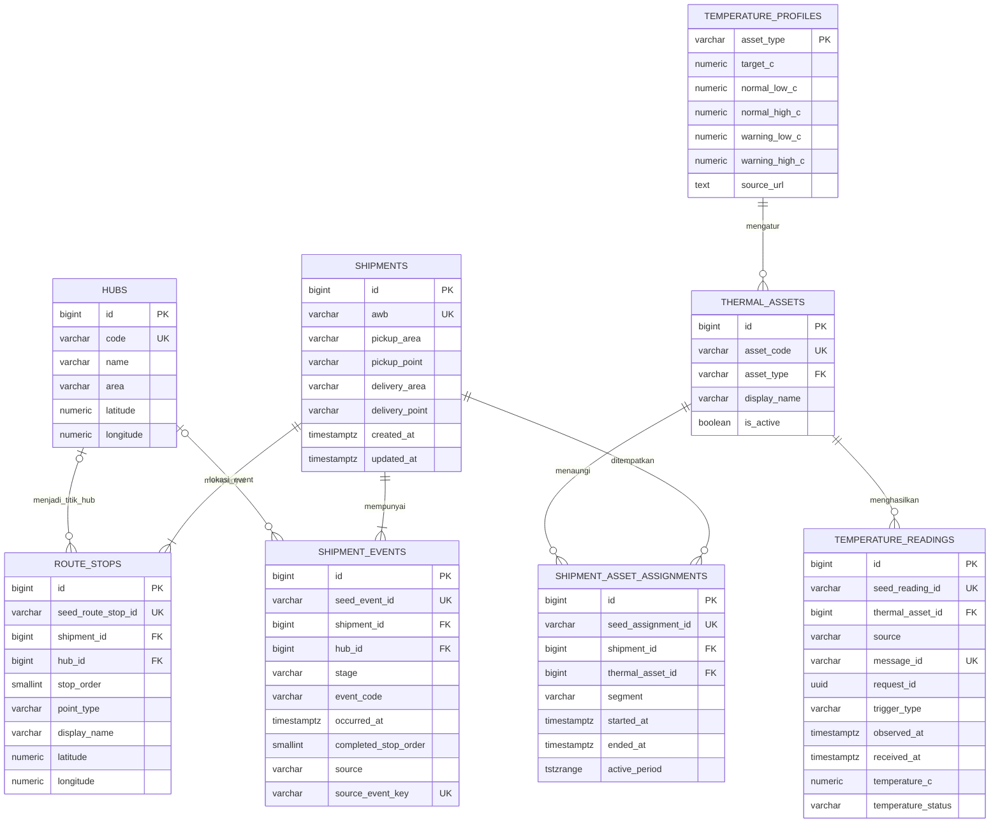

# Database Anteraja Frozen

## 1. Tujuan

Database mendukung pelacakan satu AWB, urutan pickup–hub–delivery, riwayat kejadian pengiriman, penugasan paket ke aset termal, serta pembacaan suhu aset. Database tidak menyimpan GPS langsung, pesanan, pembayaran, akun kurir, atau data sensor fisik.

DBMS yang digunakan adalah **PostgreSQL 15 atau lebih baru**. DBeaver dapat digunakan sebagai aplikasi untuk membuat koneksi, menjalankan SQL, melihat tabel, dan mengimpor CSV. DBeaver bukan server database; PostgreSQL tetap harus berjalan di komputer lokal.

## 2. Permasalahan database yang diselesaikan

### 2.1 Shipment bukan hanya satu baris status

Satu AWB dapat melewati beberapa hub dan memiliki banyak kejadian. Karena itu, `current_stage` tidak cukup untuk menyimpan perjalanan paket. Identitas paket disimpan di `shipments`, sedangkan riwayatnya disimpan di `shipment_events`.

### 2.2 Tidak semua paket melewati tahap yang sama

Paket boleh melewati tahap tertentu. Perjalanan antardua hub juga dapat membentuk urutan `AT_HUB → IN_TRANSIT → AT_HUB`. Database menyimpan event yang benar-benar terjadi dan tidak membuat baris untuk tahap yang dilewati.

### 2.3 Rute dan event adalah data berbeda

`route_stops` menyatakan rencana urutan titik pada peta. `shipment_events` menyatakan kejadian yang sudah terjadi. Pemisahan ini diperlukan agar peta dapat memperlihatkan bagian selesai dan bagian berikutnya tanpa mengarang timestamp.

### 2.4 Suhu dimiliki aset, bukan AWB

Node-RED menghasilkan pembacaan untuk cooler bag, freezer hub, atau mobil boks. Jika beberapa AWB berada pada aset yang sama dalam waktu yang sama, semuanya dapat memakai satu pembacaan tersebut. Menyalin pembacaan per AWB akan memboroskan penyimpanan dan dapat menghasilkan nilai yang tidak konsisten.

### 2.5 Paket dapat berpindah aset

Satu AWB dapat berpindah dari cooler bag ke freezer hub, kemudian ke mobil boks. `shipment_asset_assignments` menyimpan interval setiap penugasan. Satu AWB hanya boleh mempunyai satu aset aktif pada suatu waktu, tetapi satu aset boleh menaungi banyak AWB.

### 2.6 Ingest harus idempotent

Node-RED dapat mengirim ulang pesan yang sama. Kombinasi `source + message_id` dibuat unik agar retry tidak menggandakan pembacaan. `request_id` digunakan untuk menghubungkan pembacaan `ON_DEMAND` dengan permintaan Refresh.

### 2.7 Data ringkasan tidak boleh bertentangan dengan histori

Status, waktu terakhir, dan stop selesai diturunkan dari event terbaru. Kolom snapshot pada dataset hanya digunakan untuk rekonsiliasi seed, bukan sebagai sumber kebenaran produksi.

## 3. Dataset sebagai seed

Ya, delapan CSV yang telah dibuat digunakan sebagai **seed data**. Seed adalah data awal untuk menjalankan, mendemonstrasikan, dan menguji aplikasi sebelum tersedia integrasi operasional nyata.

| CSV | Baris | Tabel seed | Tabel produksi |
|---|---:|---|---|
| `shipments.csv` | 70 | `seed.shipments` | `shipments` |
| `hubs.csv` | 10 | `seed.hubs` | `hubs` |
| `route_stops.csv` | 266 | `seed.route_stops` | `route_stops` |
| `shipment_events.csv` | 274 | `seed.shipment_events` | `shipment_events` |
| `thermal_assets.csv` | 86 | `seed.thermal_assets` | `thermal_assets` |
| `shipment_asset_assignments.csv` | 260 | `seed.shipment_asset_assignments` | `shipment_asset_assignments` |
| `temperature_profiles.csv` | 3 | `seed.temperature_profiles` | `temperature_profiles` |
| `temperature_readings_seed.csv` | 400 | `seed.temperature_readings` | `temperature_readings` |

Totalnya **1.369 baris data**. Seluruh ID unik, foreign key antardataset valid, rute konsisten, assignment tidak tumpang tindih, dan 400 label suhu sesuai profil.

Schema `seed` hanya menjadi area masuk CSV. Laravel membaca tabel produksi pada schema `public`, bukan tabel `seed`.

## 4. ERD produksi



## 5. Entity dan tanggung jawabnya

| Entity | Fungsi | Sumber kebenaran |
|---|---|---|
| `shipments` | Identitas AWB dan konteks pickup/delivery. | Satu AWB satu baris. |
| `hubs` | Master hub dan koordinat penanda. | Kode hub unik. |
| `route_stops` | Urutan titik rute pada peta. | Unik per shipment dan `stop_order`. |
| `shipment_events` | Histori kejadian pengiriman. | Status terbaru berasal dari event terakhir. |
| `temperature_profiles` | Ambang suhu per jenis aset. | Satu profil per `asset_type`. |
| `thermal_assets` | Identitas aset termal. | `asset_code` unik. |
| `shipment_asset_assignments` | Interval AWB berada pada aset. | Tidak boleh overlap untuk AWB yang sama. |
| `temperature_readings` | Pembacaan suhu aset. | Unik berdasarkan `source + message_id`. |

Kolom `seed_*_id` mempertahankan ID dari dataset seperti `RS-*`, `EV-*`, `AS-*`, dan `TR-*`. Primary key aplikasi tetap `bigint identity`, sehingga data runtime tidak bergantung pada format ID seed.

## 6. Relationship

### `shipments 1:N route_stops`

Satu AWB mempunyai beberapa titik rute. Kombinasi `(shipment_id, stop_order)` harus unik.

### `hubs 1:N route_stops` secara opsional

Stop `HUB` wajib mempunyai `hub_id`. Stop `PICKUP` dan `DELIVERY` tidak mempunyai `hub_id` karena menggunakan nama kawasan dan koordinat pada stop itu sendiri.

### `shipments 1:N shipment_events`

Satu AWB mempunyai beberapa event. Event terbaru ditentukan dengan `occurred_at DESC, id DESC`.

### `hubs 1:N shipment_events` secara opsional

Event `ARRIVED_HUB` dan `LEFT_HUB` wajib menunjuk hub. Event pickup dan delivered tidak wajib mempunyai hub.

### `temperature_profiles 1:N thermal_assets`

Banyak aset sejenis menggunakan satu profil suhu.

### `shipments N:M thermal_assets`

Hubungan many-to-many diselesaikan oleh `shipment_asset_assignments`. Relasi ini mempunyai atribut waktu, sehingga sebuah reading hanya berlaku untuk AWB jika:

```text
reading.thermal_asset_id = assignment.thermal_asset_id
dan reading.observed_at berada dalam [started_at, ended_at)
```

### `thermal_assets 1:N temperature_readings`

Satu aset menghasilkan banyak reading. Reading tidak mempunyai `shipment_id` karena satu reading dapat berlaku bagi beberapa AWB.

## 7. Status dan aturan bisnis

Tahap yang digunakan:

- `PICKED_UP`
- `AT_HUB`
- `IN_TRANSIT`
- `OUT_FOR_DELIVERY`
- `DELIVERED`

Kode kejadian minimum:

- `PICKED_UP → PICKED_UP`
- `ARRIVED_HUB → AT_HUB`
- `LEFT_HUB → IN_TRANSIT`
- `IN_TRANSIT → IN_TRANSIT`
- `OUT_FOR_DELIVERY → OUT_FOR_DELIVERY`
- `DELIVERED → DELIVERED`

Paket tidak wajib melewati kelima tahap. Database tidak menggunakan angka peringkat sederhana untuk menilai kemajuan karena `AT_HUB → IN_TRANSIT → AT_HUB` merupakan urutan yang sah.

Ketika paket delivered:

- event `DELIVERED` menjadi event terakhir;
- assignment aktif ditutup dengan mengisi `ended_at`;
- pembacaan baru tidak lagi dikaitkan dengan paket;
- UI menampilkan pembacaan terakhir, bukan meminta suhu baru.

## 8. Integritas dan efisiensi

DDL menerapkan:

- unique constraint untuk AWB, kode hub, kode aset, ID seed, dan message ID;
- foreign key untuk seluruh relationship produksi;
- check constraint untuk enum sederhana, koordinat, suhu, timestamp, serta pasangan event-stage;
- exclusion constraint `tstzrange` untuk mencegah assignment satu AWB bertumpuk;
- unique partial index untuk memastikan satu shipment hanya mempunyai satu assignment aktif sekaligus mempercepat lookup aset aktif berdasarkan `shipment_id`;
- partial index untuk assignment aktif berdasarkan aset, request on-demand, dan pembacaan anomali;
- indeks event dan reading berdasarkan waktu terbaru;
- tidak membuat index tambahan pada `(shipment_id, stop_order)` di `route_stops` karena unique constraint dengan kolom yang sama sudah otomatis menghasilkan index;
- view `shipment_current_status`;
- view `shipment_temperature_history`;
- view `shipment_latest_temperature`.

Aturan lintas banyak baris tetap dijaga Laravel, misalnya rute wajib diawali pickup dan diakhiri delivery, event tidak boleh ditambahkan setelah delivered, penutupan assignment, rate limit Refresh, serta perhitungan status suhu.

## 9. Berkas SQL

Gunakan dua berkas berikut secara berurutan:

1. `anteraja_frozen_schema.sql` — extension, schema seed, tabel produksi, constraint, indeks, trigger, dan view.
2. `anteraja_frozen_seed_transform.sql` — memindahkan data dari schema seed ke tabel produksi dan menjalankan rekonsiliasi.

## 10. Membuat PostgreSQL lokal

Contoh berikut ditujukan untuk Ubuntu/Linux.

### 10.1 Instal PostgreSQL

```bash
sudo apt update
sudo apt install postgresql postgresql-contrib
sudo systemctl enable --now postgresql
sudo systemctl status postgresql
```

### 10.2 Buat user dan database

Masuk ke PostgreSQL:

```bash
sudo -u postgres psql
```

Jalankan:

```sql
CREATE ROLE anteraja_app
    WITH LOGIN PASSWORD 'ganti-password-lokal-ini';

CREATE DATABASE anteraja_frozen
    OWNER anteraja_app;
```

Keluar dengan:

```text
\q
```

Password lokal tidak boleh dimasukkan ke GitHub.

### 10.3 Jalankan DDL melalui terminal

```bash
psql -h localhost -p 5432 \
  -U anteraja_app \
  -d anteraja_frozen \
  -f /path/ke/anteraja_frozen_schema.sql
```

Setelah selesai, database mempunyai schema `public` untuk aplikasi dan schema `seed` untuk impor CSV.

## 11. Menghubungkan DBeaver

1. Buka DBeaver.
2. Pilih **New Database Connection**.
3. Pilih **PostgreSQL**.
4. Isi:

| Field | Nilai |
|---|---|
| Host | `localhost` |
| Port | `5432` |
| Database | `anteraja_frozen` |
| Username | `anteraja_app` |
| Password | password lokal yang dibuat sebelumnya |

5. Pilih **Test Connection**.
6. Jika driver PostgreSQL belum tersedia, izinkan DBeaver mengunduh driver.
7. Pilih **Finish**.

Jika DDL belum dijalankan lewat terminal, buka **SQL Editor**, buka `anteraja_frozen_schema.sql`, lalu jalankan seluruh script.

## 12. Mengimpor delapan CSV melalui DBeaver

Impor setiap CSV ke tabel dengan nama yang sesuai pada schema `seed`:

1. Klik kanan tabel tujuan, misalnya `seed.shipments`.
2. Pilih **Import Data**.
3. Pilih sumber **CSV**.
4. Pilih file yang sesuai.
5. Aktifkan bahwa baris pertama adalah header.
6. Periksa pemetaan kolom.
7. Untuk temperature readings, petakan kolom CSV `trigger` ke kolom database `trigger_type`.
8. Pastikan string kosong pada `request_id`, `ended_at`, `hub_code`, dan `source_url` masuk sebagai `NULL`.
9. Jalankan import.

Urutan impor ke schema `seed` bebas karena tabel raw tidak menggunakan foreign key. Nama file dan tabel:

| File | Tabel tujuan |
|---|---|
| `shipments.csv` | `seed.shipments` |
| `hubs.csv` | `seed.hubs` |
| `route_stops.csv` | `seed.route_stops` |
| `shipment_events.csv` | `seed.shipment_events` |
| `temperature_profiles.csv` | `seed.temperature_profiles` |
| `thermal_assets.csv` | `seed.thermal_assets` |
| `shipment_asset_assignments.csv` | `seed.shipment_asset_assignments` |
| `temperature_readings_seed.csv` | `seed.temperature_readings` |

Setelah semua CSV masuk, buka dan jalankan `anteraja_frozen_seed_transform.sql`. Transformasi produksi berlangsung dalam satu transaksi. Jika validasi gagal, transaksi dibatalkan sehingga database tidak terisi sebagian.

## 13. Verifikasi hasil

Jalankan query berikut:

```sql
SELECT 'shipments' AS entity, count(*) FROM shipments
UNION ALL SELECT 'hubs', count(*) FROM hubs
UNION ALL SELECT 'route_stops', count(*) FROM route_stops
UNION ALL SELECT 'shipment_events', count(*) FROM shipment_events
UNION ALL SELECT 'temperature_profiles', count(*) FROM temperature_profiles
UNION ALL SELECT 'thermal_assets', count(*) FROM thermal_assets
UNION ALL SELECT 'shipment_asset_assignments', count(*) FROM shipment_asset_assignments
UNION ALL SELECT 'temperature_readings', count(*) FROM temperature_readings;
```

Hasil yang diharapkan:

| Entity | Jumlah |
|---|---:|
| shipments | 70 |
| hubs | 10 |
| route_stops | 266 |
| shipment_events | 274 |
| temperature_profiles | 3 |
| thermal_assets | 86 |
| shipment_asset_assignments | 260 |
| temperature_readings | 400 |

Coba satu AWB:

```sql
SELECT
    s.awb,
    cs.current_stage,
    cs.last_stage_at,
    lt.asset_code,
    lt.asset_type,
    lt.temperature_c,
    lt.temperature_status,
    lt.observed_at
FROM shipments s
LEFT JOIN shipment_current_status cs ON cs.shipment_id = s.id
LEFT JOIN shipment_latest_temperature lt ON lt.shipment_id = s.id
WHERE s.awb = 'ANT-FRZ-0002';
```
- aktifkan SSL;
- jangan mengekspos schema `seed` melalui API publik;
- batasi akses database hanya untuk backend;
- buat backup sebelum migrasi atau import ulang;
- tinjau retention histori suhu jika volume reading mulai besar.
