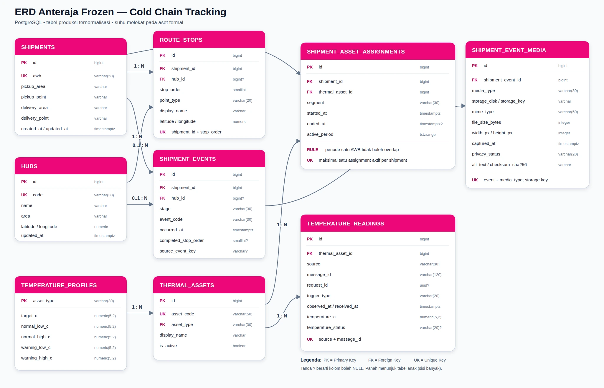

# DB — Model Data Anteraja Frozen

**Acuan:** [PRD](prd.md) · [FRD global](frd.md) · [FRD per fitur](frd/README.md) · [IA](ia.md) · **DBMS:** PostgreSQL 15+

Dokumen ini menjadi sumber utama dokumentasi database untuk fitur pelacakan paket dan pemantauan suhu Anteraja Frozen. Fokus data meliputi pencarian AWB, status dan linimasa perjalanan, rute pickup–hub–delivery, aset termal yang menangani paket, riwayat suhu, dan pembaruan suhu terjadwal maupun atas permintaan pengguna.

## 1. Isi folder

```text
docs/
├── db.md
└── database/
    ├── sql/
    │   ├── anteraja_frozen_schema.sql
    │   └── anteraja_frozen_seed_transform.sql
    ├── erd/
    │   ├── anteraja-frozen-erd.webp
    │   └── anteraja-frozen-erd.svg
    └── sample-data/
        ├── shipments.csv
        ├── hubs.csv
        ├── route_stops.csv
        ├── shipment_events.csv
        ├── shipment_event_media.csv
        ├── media/
        │   ├── README.md
        │   └── shipment-events/   # 3 foto WebP sesuai storage_key CSV
        ├── temperature_profiles.csv
        ├── thermal_assets.csv
        ├── shipment_asset_assignments.csv
        └── temperature_readings_seed.csv
```

## 2. Analisis kebutuhan FRD dan UI

| Kebutuhan | Data yang diperlukan | Tabel pendukung |
|---|---|---|
| FR-01 — mencari paket berdasarkan AWB | Nomor AWB unik dan informasi asal/tujuan | `shipments` |
| FR-02 — status, linimasa, dan dokumentasi | Tahap, jenis kejadian, waktu kejadian, hub, titik yang dicapai, serta metadata foto pickup/delivery | `shipment_events`, `shipment_event_media`, `hubs`, `route_stops` |
| FR-03 — peta dan urutan titik singgah | Urutan pickup, satu atau beberapa hub, tujuan, serta koordinat penanda | `route_stops`, `hubs` |
| FR-04 — suhu dan riwayat telemetri | Identitas aset, profil ambang, nilai suhu, status, dan waktu observasi | `thermal_assets`, `temperature_profiles`, `temperature_readings` |
| FR-05 — pembaruan suhu | Aset aktif paket, `request_id`, jenis pemicu, dan pembacaan terbaru | `shipment_asset_assignments`, `temperature_readings` |
| FR-06 — sumber data suhu | Sumber pesan, ID pesan untuk deduplikasi, dan waktu diterima | `temperature_readings` |

Rancangan UI menampilkan status terkini, linimasa, peta, suhu terkini, ringkasan suhu per segmen, dan histori suhu. Karena itu, status paket tidak disimpan sebagai teks yang terus ditimpa. Status dihitung dari event terakhir. Suhu juga tidak ditempelkan langsung ke AWB karena sensor mengukur suhu aset seperti freezer hub, cooler bag, atau mobil boks.

## 3. ERD



Relasi utama:

- satu `shipment` mempunyai banyak `route_stops`;
- satu `shipment` mempunyai banyak `shipment_events`;
- satu `shipment_event` dapat memiliki maksimal satu media untuk jenis yang sesuai;
- satu `hub` dapat dipakai oleh banyak route stop dan event;
- satu `temperature_profile` digunakan banyak `thermal_assets` sejenis;
- hubungan paket dengan aset bersifat banyak-ke-banyak dan diselesaikan oleh `shipment_asset_assignments`;
- satu `thermal_asset` menghasilkan banyak `temperature_readings`;
- satu pembacaan aset dapat berlaku bagi beberapa AWB yang berada pada aset tersebut dalam rentang waktu yang sama.

## 4. Penjelasan tabel produksi

| Tabel | Isi dan fungsi |
|---|---|
| `shipments` | Satu baris untuk satu AWB. Menyimpan kawasan/titik pickup dan delivery. |
| `hubs` | Master titik hub beserta kode, nama, area, dan koordinat penanda peta. |
| `route_stops` | Rencana urutan titik yang dilalui satu AWB. Kombinasi `shipment_id` dan `stop_order` harus unik. |
| `shipment_events` | Catatan kejadian yang benar-benar terjadi, misalnya pickup, tiba hub, keluar hub, transit, sedang diantar, dan delivered. |
| `shipment_event_media` | Metadata foto pickup/delivery. File gambar tidak disimpan di PostgreSQL; tabel hanya menyimpan storage key privat, MIME, ukuran, dimensi, waktu, status privasi, alt text, dan checksum. |
| `temperature_profiles` | Target serta batas normal/peringatan suhu untuk setiap jenis aset. |
| `thermal_assets` | Identitas cooler bag, freezer hub, dan mobil boks yang menghasilkan data suhu. |
| `shipment_asset_assignments` | Interval waktu sebuah AWB berada pada aset tertentu. Satu AWB hanya boleh memiliki satu assignment aktif pada satu waktu. |
| `temperature_readings` | Pembacaan suhu per aset, waktu observasi, sumber, jenis pemicu, dan status termal. |

Schema `seed` juga berisi sembilan tabel sementara dengan bentuk yang mendekati CSV. Aplikasi tidak membaca schema ini. Data dipindahkan ke tabel produksi oleh `anteraja_frozen_seed_transform.sql` setelah seluruh CSV selesai diimpor.

## 5. Normalisasi

Rancangan menerapkan prinsip normalisasi sampai bentuk yang sesuai untuk kebutuhan MVP:

1. Setiap kolom menyimpan satu nilai atomik; rute, event, assignment, dan reading tidak disimpan sebagai daftar di dalam `shipments`.
2. Data hub, profil suhu, dan aset hanya disimpan sekali pada tabel master masing-masing.
3. Nama dan tipe aset tidak disalin ke setiap pembacaan suhu; reading cukup menyimpan foreign key `thermal_asset_id`.
4. Hubungan banyak-ke-banyak shipment–aset dipisahkan ke tabel penghubung karena memiliki atribut waktu mulai dan selesai.
5. Status terbaru diturunkan dari `shipment_events`, sehingga tidak ada dua sumber status yang dapat saling bertentangan.
6. Metadata foto dipisahkan dari event agar event tetap atomik dan storage file dapat dikelola Laravel tanpa menyimpan binary besar di PostgreSQL.

## 6. Integritas dan optimasi

DDL menyediakan:

- primary key dan unique constraint untuk AWB, kode hub, kode aset, serta ID pesan;
- foreign key untuk menjaga semua hubungan tabel;
- check constraint untuk tipe status, koordinat, suhu, dan urutan waktu;
- exclusion constraint PostgreSQL agar periode assignment satu AWB tidak tumpang tindih;
- unique partial index agar satu AWB hanya mempunyai satu assignment aktif;
- index event terbaru, reading terbaru, assignment aktif, dan pembacaan anomali;
- unique constraint satu foto per jenis per event, index media publik, checksum SHA-256, batas 10 MB, MIME/dimensi, serta trigger pencocokan jenis foto dengan event pickup/delivered;
- deduplikasi pesan suhu melalui kombinasi `source + message_id`;
- view `shipment_current_status`, `shipment_public_event_media`, `shipment_temperature_history`, dan `shipment_latest_temperature` untuk kebutuhan API Laravel.

## 7. Sample data

Sample data terdiri dari sembilan CSV yang saling berelasi:

| File | Jumlah data | Tujuan |
|---|---:|---|
| `shipments.csv` | 70 | AWB dan ringkasan konteks pengiriman |
| `hubs.csv` | 10 | Master hub |
| `route_stops.csv` | 266 | Urutan pickup–hub–delivery |
| `shipment_events.csv` | 274 | Riwayat kejadian pengiriman |
| `shipment_event_media.csv` | 3 | Metadata contoh foto pickup/delivery; storage key tidak menunjuk file publik |
| `temperature_profiles.csv` | 3 | Profil suhu per jenis aset |
| `thermal_assets.csv` | 86 | Master aset termal |
| `shipment_asset_assignments.csv` | 260 | Histori perpindahan paket antar-aset |
| `temperature_readings_seed.csv` | 400 | Pembacaan suhu awal |

Total sample data adalah **1.372 baris**. Data ini digunakan untuk perancangan dan pengujian, bukan data pengiriman operasional Anteraja.

### Alur penyimpanan foto

1. Laravel menerima file dari proses internal yang berwenang, bukan dari halaman tracking publik.
2. Backend memvalidasi MIME, ukuran maksimal 10 MB, dimensi, serta event yang dituju.
3. EXIF/GPS dihapus; wajah dan label alamat disamarkan bila diperlukan.
4. File disimpan pada disk privat Laravel atau object storage. PostgreSQL hanya menerima `storage_disk`, `storage_key`, metadata, status privasi, dan checksum.
5. API tracking hanya mengembalikan foto berstatus `APPROVED` atau `REDACTED` melalui URL bertanda tangan yang berumur pendek. `storage_key` asli tidak dikirim ke browser.

Pemisahan ini menghindari penyimpanan binary besar di PostgreSQL, mempermudah penggunaan CDN/object storage, dan menjaga kontrol akses tetap berada di backend.

## 8. Cara membuat database PostgreSQL

### Langkah 1 — buat database

Contoh melalui PostgreSQL CLI:

```bash
createdb anteraja_frozen
```

Atau buat database bernama `anteraja_frozen` melalui DBeaver.

### Langkah 2 — jalankan DDL

```bash
psql -U postgres -d anteraja_frozen \
  -f docs/database/sql/anteraja_frozen_schema.sql
```

DDL membuat extension `btree_gist`, schema `seed`, tabel, constraint, index, trigger, dan view.

### Langkah 3 — impor CSV ke schema `seed`

Impor melalui fitur **Import Data** pada DBeaver dengan urutan:

1. `temperature_profiles.csv` → `seed.temperature_profiles`
2. `hubs.csv` → `seed.hubs`
3. `thermal_assets.csv` → `seed.thermal_assets`
4. `shipments.csv` → `seed.shipments`
5. `route_stops.csv` → `seed.route_stops`
6. `shipment_events.csv` → `seed.shipment_events`
7. `shipment_event_media.csv` → `seed.shipment_event_media`
8. `shipment_asset_assignments.csv` → `seed.shipment_asset_assignments`
9. `temperature_readings_seed.csv` → `seed.temperature_readings`

Saat mengimpor file terakhir, petakan kolom CSV `trigger` ke kolom tabel `trigger_type`.

### Langkah 4 — transformasikan seed

```bash
psql -U postgres -d anteraja_frozen \
  -f docs/database/sql/anteraja_frozen_seed_transform.sql
```

Transformasi berjalan dalam transaksi. Jika validasi relasi atau rekonsiliasi gagal, transaksi dibatalkan agar tabel produksi tidak terisi sebagian.

### Langkah 5 — verifikasi

```sql
SELECT count(*) FROM shipments;                    -- 70
SELECT count(*) FROM hubs;                         -- 10
SELECT count(*) FROM route_stops;                  -- 266
SELECT count(*) FROM shipment_events;              -- 274
SELECT count(*) FROM shipment_event_media;         -- 3
SELECT count(*) FROM temperature_profiles;         -- 3
SELECT count(*) FROM thermal_assets;                -- 86
SELECT count(*) FROM shipment_asset_assignments;    -- 260
SELECT count(*) FROM temperature_readings;          -- 400
```

Contoh memeriksa satu paket:

```sql
SELECT
    s.awb,
    cs.current_stage,
    cs.last_stage_at,
    lt.asset_code,
    lt.temperature_c,
    lt.observed_at
FROM shipments s
LEFT JOIN shipment_current_status cs ON cs.shipment_id = s.id
LEFT JOIN shipment_latest_temperature lt ON lt.shipment_id = s.id
WHERE s.awb = 'ANT-FRZ-0002';
```
