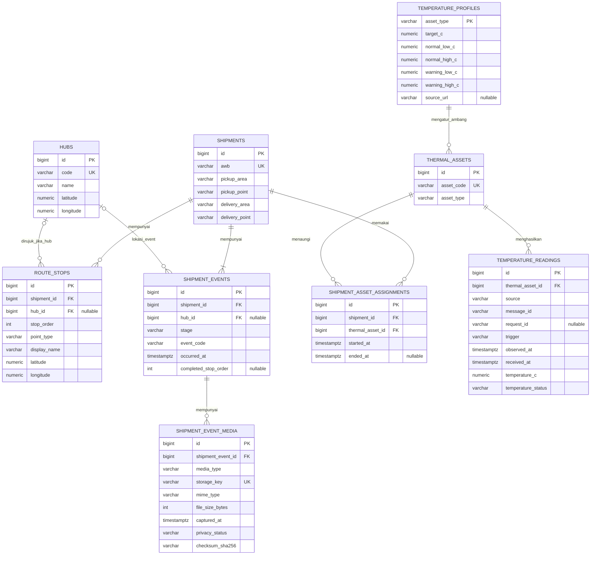
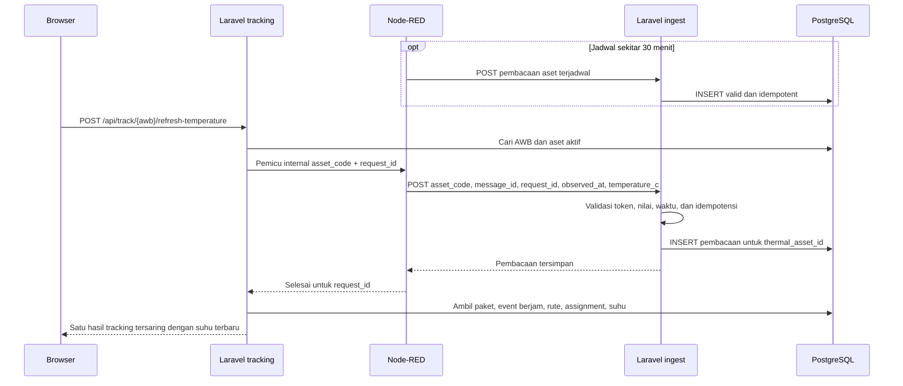

# DB — Model Data dan ERD Anteraja Frozen

**Acuan:** [PRD](prd.md) · [FRD global](frd.md) · [IA](ia.md) · **DBMS:** PostgreSQL

## 1. Prinsip data

Satu AWB = satu baris `shipments`. Rute, kejadian tahap **dengan jamnya**, penugasan aset, dan pembacaan suhu memakai tabel terpisah karena masing-masing dapat memiliki banyak baris. Node-RED mengirim suhu untuk **aset** (misalnya mobil boks atau freezer hub), bukan langsung untuk AWB. Semua waktu disimpan `timestamptz` UTC dan ditampilkan WIB; nilai suhu `numeric`, bukan teks. Data awal dan pembacaan baru dibedakan oleh kolom `source`/`trigger`; [dataset 70 AWB](frozen_dataset_70_20260918/README.md) merupakan data kerja tahap perancangan, bukan catatan operasional Anteraja.

## 2. ERD

## 3. Kamus tabel minimum

| Tabel | Kolom wajib dan batasan penting | Fungsi |
|---|---|---|
| `shipments` | `id`, `awb` unik, `pickup_area`, `pickup_point`, `delivery_area`, `delivery_point`; `created_at/updated_at` | Identitas paket, satu per AWB; nama titik setingkat kawasan, tanpa data pribadi. |
| `hubs` | `id`, `code` unik, `name`, `latitude`, `longitude` | Titik singgah pada peta. |
| `route_stops` | `shipment_id`, `stop_order >= 0`, `point_type=PICKUP|HUB|DELIVERY`, `hub_id?`, `display_name`, `latitude`, `longitude`; unik (`shipment_id`,`stop_order`) | Urutan pickup → satu/beberapa hub → delivery pada peta. `hub_id` wajib hanya untuk titik HUB; koordinat hanya penanda kawasan. |
| `shipment_events` | `shipment_id`, `stage`, `event_code`, `occurred_at`, `hub_id?`, `completed_stop_order?`, `source_event_key?` | Riwayat pickup/tiba hub/keluar hub/transit/pengantaran/delivered yang benar-benar tercatat beserta jam; indeks (`shipment_id`,`occurred_at DESC`,`id DESC`). |
| `shipment_event_media` | `shipment_event_id`, `media_type`, `storage_disk`, `storage_key`, `mime_type`, ukuran/dimensi, `captured_at`, `alt_text`, `privacy_status`, `checksum_sha256` | Metadata foto pickup/delivery. File disimpan di private storage, bukan di PostgreSQL; maksimal satu foto per jenis pada satu event. |
| `thermal_assets` | `asset_code` unik, `asset_type` mengacu ke `temperature_profiles.asset_type` | Identitas aset termal seperti cooler bag, freezer hub, atau mobil boks pada rancangan. |
| `temperature_profiles` | `asset_type` unik, `target_c`, `normal_low_c`, `normal_high_c`, `warning_low_c`, `warning_high_c`, `source_url?`; `warning_low_c < normal_low_c <= normal_high_c < warning_high_c` | Parameter pembacaan dan klasifikasi suhu per jenis aset; `source_url` hanya diisi jika ada rujukan langsung. |
| `shipment_asset_assignments` | `shipment_id`, `thermal_asset_id`, `started_at`, `ended_at?`; `ended_at > started_at` bila terisi | Relasi aset–paket dalam interval waktu. Satu aset boleh punya banyak AWB bersamaan. |
| `temperature_readings` | `thermal_asset_id`, `source`, `message_id`, `request_id?`, `trigger`, `observed_at`, `received_at`, `temperature_c`, `temperature_status`; unik (`source`,`message_id`) | Pembacaan terjadwal/atas Refresh dari Node-RED, dideduplikasi; indeks (`thermal_asset_id`,`observed_at DESC`,`id DESC`). |

Nilai `stage`: `PICKED_UP`, `AT_HUB`, `IN_TRANSIT`, `OUT_FOR_DELIVERY`, `DELIVERED`. `event_code` minimum: `PICKED_UP`, `ARRIVED_HUB`, `LEFT_HUB`, `IN_TRANSIT`, `OUT_FOR_DELIVERY`, `DELIVERED`; kode dan tahap harus konsisten (misalnya `ARRIVED_HUB → AT_HUB`, `LEFT_HUB → IN_TRANSIT`). `trigger`: `SEED` untuk riwayat awal, lalu `SCHEDULED` atau `ON_DEMAND` untuk Node-RED; `request_id` hanya diperlukan untuk on-demand. `source` data awal adalah `SEED`, sedangkan pembacaan berikutnya `NODE_RED`. `temperature_status` dapat berupa `NORMAL`, `WARNING`, `CRITICAL` menurut profil ambang **per jenis aset** pada `temperature_profiles.csv`; tanpa profil, status boleh `NULL` dan UI menampilkan angka tanpa label. Rentang normal freezer hub −5 s.d. −2 °C merujuk [Anteraja](https://blog.anteraja.id/anteraja-frozen/); cooler bag dan mobil boks −8 s.d. −2 °C adalah parameter rancangan. Perubahan ambang tidak otomatis mengubah histori: keputusan hitung ulang harus eksplisit.

## 4. Aturan integritas dan query tracking

- Rute dimulai satu titik `PICKUP`, diikuti nol/lebih titik `HUB`, dan berakhir satu titik `DELIVERY`. Untuk skenario MVP, seed menyertakan contoh satu dan beberapa hub. Koordinat hub pada `route_stops` harus sesuai hub yang dirujuk saat impor. `completed_stop_order`, jika ada, harus menunjuk stop pada rute AWB tersebut; tidak boleh melebihi stop terakhir. Tanpa rute/progres yang valid, UI tidak mewarnai segmen sebagai telah dilalui.
- Interval penugasan untuk **AWB yang sama** tidak boleh tumpang tindih: satu aset aktif pada suatu waktu, dan histori boleh berganti dari cooler bag ke freezer hub lalu mobil boks. Aset yang sama boleh ditugaskan ke beberapa AWB. Validasi ini berada di service/backend dan dapat diperkuat constraint rentang PostgreSQL. Penugasan ditutup saat `DELIVERED`; Refresh setelah itu tidak menghasilkan pembacaan baru.
- Pembacaan suhu untuk AWB diambil dari `temperature_readings.thermal_asset_id = assignment.thermal_asset_id` dan `observed_at >= started_at` serta (`ended_at IS NULL` atau `observed_at < ended_at`). Pembacaan tanpa assignment sah **tidak** dipublikasikan pada AWB.
- Status terbaru dipilih dari `shipment_events` menurut `occurred_at DESC, id DESC`; event tahap yang dilompati tidak dibuat. `DELIVERED` hanya mewarnai seluruh rute jika event/progres menunjukkan rute selesai.
- Media `PICKUP_PHOTO` hanya boleh terkait event `PICKED_UP`, sedangkan `DELIVERY_PHOTO` hanya untuk `DELIVERED`. API publik hanya mengirim media `APPROVED`/`REDACTED` melalui URL sementara; `storage_key`, EXIF/GPS, wajah, dan label alamat tidak diekspos.
- Batasi riwayat suhu yang dikirim ke browser (misalnya 20 terbaru, urut waktu terbalik); tampilkan waktu pembacaan. Jika perlu histori lebih panjang, tambahkan pagination nanti.
- Saat impor, tolak AWB ganda, referensi hub/aset yang tidak ada, urutan/rentang waktu tidak valid, dan transisi yang tidak sah. `AT_HUB → IN_TRANSIT → AT_HUB` **sah** untuk rute multi-hub; jangan menolak dengan aturan ranking linear. Jika sumber hanya snapshot, buat satu event status tanpa mengarang kejadian sebelumnya.

## 5. Contoh alur penyimpanan

Skema ini disiapkan untuk sumber suhu Node-RED sekarang dan sensor kelak. Beralih ke perangkat nyata tetap memerlukan autentikasi perangkat, pemeriksaan kualitas data, serta integrasi status logistik tersendiri.
