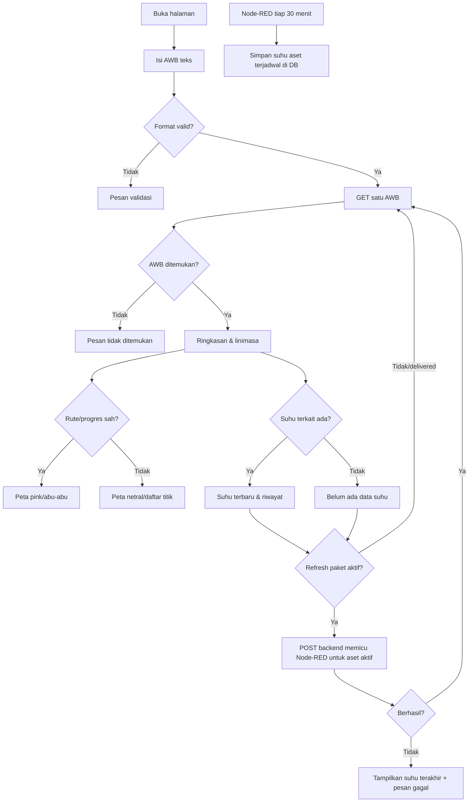

# FRD Global — Anteraja Frozen

**Acuan produk:** [PRD](prd.md) · **Detail fungsi:** [FRD per fitur](frd/README.md) · **Data:** [DB](db.md)

FRD global ini memuat ketentuan yang berlaku untuk semua fitur. Detail input, perilaku layar, endpoint, kesalahan, dan pengujian tiap fungsi berada di spesifikasi FR-01 sampai FR-06.

## 1. Konteks

MVP menguji tujuan PRD: pemilik AWB dapat memahami riwayat pengantaran bertanggal/jam—pickup, tiba/keluar hub, dalam perjalanan, pengantaran, delivered sesuai data—dan pembacaan suhu dalam satu halaman. Status/rute berasal dari dataset kerja; suhu baru berasal dari Node-RED terjadwal atau pemicu Refresh. Pembacaan suhu tidak membuktikan posisi paket, tidak mengubah tahap, dan bukan suhu inti produk. Dataset kerja bukan informasi operasional resmi Anteraja.

## 2. Peran dan hak akses

| Aktor | Boleh lihat | Boleh buat/ubah | Field/akses terlarang |
|---|---|---|---|
| Pengunjung dengan AWB | Satu respons tracking publik melalui `GET /api/track/{awb}`, termasuk dokumentasi event yang telah lolos pemeriksaan privasi. | Meminta pembacaan suhu baru melalui `POST /api/track/{awb}/refresh-temperature` untuk paket aktif; tidak dapat menulis nilai suhu atau foto. | Daftar semua AWB, data pribadi, storage key asli, EXIF/GPS, kredensial, endpoint ingest. |
| Node-RED | Respons sukses/gagal atas kiriman sendiri. | Membuat pembacaan suhu melalui POST internal bertoken; retry idempotent. | Mengubah AWB, tahap, rute, atau penugasan aset. |
| Pengembang/pengelola seed | Data pengujian pada lingkungan pengembangan. | Menjalankan migrasi, seed, dan konfigurasi di luar UI. | Bukan akun atau hak akses produk publik. |

API tracking hanya mengembalikan AWB, area asal/tujuan, event tahap, rute ilustratif, dan suhu terkait; tidak mengembalikan nama, telepon, atau alamat rinci. Lookup diberi rate limit. Token mesin tidak dikirim ke browser.

## 3. Alur global dan percabangan

Kegagalan jaringan/tile tidak disamakan dengan AWB tidak ditemukan. Bila API gagal setelah hasil pernah tampil, UI boleh mempertahankan hasil lama dengan label bahwa data belum berhasil diperbarui.

## 4. Aturan bisnis

| ID | Kondisi → hasil | Pengecualian/gagal |
|---|---|---|
| BR-01 | AWB dinormalisasi sesuai format seed, lalu dicocokkan tepat ke satu paket. | Kosong/format salah `422`; tak ditemukan `404`; rate limit `429`. |
| BR-02 | Tahap terbaru berasal dari event sah terakhir berdasarkan `occurred_at`, lalu ID. Setiap event memiliki waktu dan kode kejadian, misalnya `ARRIVED_HUB`/`LEFT_HUB`, agar riwayat terbaca. | Suhu, refresh, dan jam tidak memajukan status. |
| BR-03 | Tahap boleh dilompati. `AT_HUB → IN_TRANSIT → AT_HUB` sah bila paket bergerak dari satu hub ke hub lain. `DELIVERED` adalah akhir. | Event di luar transisi yang diizinkan atau setelah `DELIVERED` ditolak saat impor; jangan menguji “maju” dengan peringkat angka sederhana. |
| BR-04 | Tiba/keluar hub dan beberapa event `AT_HUB`/`IN_TRANSIT` boleh berulang jika kejadian berbeda dan waktunya sah. | Duplikat sumber dengan kunci event sama tidak membuat event baru. |
| BR-04A | Satu event pickup dapat memiliki maksimal satu `PICKUP_PHOTO`; satu event delivered dapat memiliki maksimal satu `DELIVERY_PHOTO`. API publik hanya mengirim media `APPROVED`/`REDACTED` melalui URL bertanda tangan sementara. | Jenis foto yang tidak cocok dengan event, file >10 MB, MIME selain JPEG/PNG/WebP, atau media yang belum lolos privasi ditolak/disembunyikan. |
| BR-05 | Rute pink hanya sampai `completed_stop_order` yang tercatat; bagian sesudahnya abu-abu. | Tanpa progres sah, garis netral; jangan menebak lokasi dari status atau suhu. |
| BR-06 | Suhu aset ditampilkan pada AWB hanya jika `observed_at` berada dalam interval penugasan aset ke AWB. | Aset tanpa assignment sah tidak muncul dalam tracking AWB. |
| BR-07 | Ingest memakai token mesin, aset dikenal, nilai/waktu valid, `message_id` unik per sumber. | Retry dengan ID sama tidak menggandakan baris; payload tak sah `422`, tanpa otorisasi `401/403`. |
| BR-08 | Backend menghitung `NORMAL` pada rentang inklusif profil aset: freezer hub −5 s.d. −2 °C; cooler bag dan mobil boks −8 s.d. −2 °C. Nilai di luar rentang normal tetapi masih dalam rentang `warning_low_c`–`warning_high_c` adalah `WARNING`; selebihnya `CRITICAL`. | Ambang freezer hub merujuk [publikasi Anteraja](https://blog.anteraja.id/anteraja-frozen/). Ambang dua aset lain adalah parameter rancangan, bukan standar resmi. Tanpa profil, tampilkan angka tanpa label; suhu produk saat serah <−18 °C bukan ambang aset. |
| BR-09 | Paket aktif dengan pembacaan terakhir >60 menit diberi label “data belum diperbarui”. Nilai dan waktu dipisah, misalnya “Suhu terakhir: −3,4 °C” dan “Terakhir diperbarui: 14.30 WIB”. | `DELIVERED` memakai “pembacaan terakhir”; tanpa suhu memakai keadaan kosong, bukan 0 °C. |
| BR-10 | Refresh paket aktif memanggil POST backend yang memicu Node-RED untuk aset aktif, menunggu pembacaan tervalidasi/tersimpan, lalu mengambil hasil tracking terbaru. Jadwal 30 menit tetap berjalan terpisah. | Paket `DELIVERED` hanya membaca riwayat; tidak membuat suhu setelah selesai. Gagal/timeout → tampilkan pembacaan terakhir dengan pesan gagal, bukan nilai baru palsu. |
| BR-11 | Pemicu publik dibatasi lajunya per AWB/aset dan permintaan bersamaan untuk aset sama digabung/dibatasi agar tidak membanjiri Node-RED. | Klik berulang sangat cepat dapat mengembalikan pembacaan terbaru yang sama dengan penjelasan jeda; tidak membuat duplikat. |

## 5. Istilah

| Istilah | Makna dalam MVP |
|---|---|
| AWB | Identitas unik satu paket dalam dataset kerja. |
| Tahap/event | Kejadian status dengan kode, lokasi bila ada, dan waktu aktual dalam seed; bukan semua langkah yang mungkin dilalui. |
| Hub/rute | Titik dan garis ilustratif, bukan GPS atau jalan sebenarnya. |
| Progres | Stop terakhir yang secara eksplisit tercatat sudah dilalui (`completed_stop_order`). |
| Aset termal | Perlengkapan tempat pembacaan suhu dikaitkan dengan paket, misalnya cooler bag, freezer hub, atau mobil boks pendingin. Mobil boks dalam rancangan bukan klaim armada Anteraja. |
| Pembacaan suhu | Suhu lingkungan aset pada satu waktu; bukan pengukuran kontinu atau suhu inti makanan. |
| Dokumentasi event | Foto pickup atau delivery yang terkait ke satu event, disimpan privat, dan ditampilkan hanya setelah pemeriksaan privasi. |
| Data awal | Dataset kerja yang disiapkan pengembang di luar UI. |

## 6. Data utama dan status

Data utama: `shipments`, `shipment_events` (termasuk `event_code`, `occurred_at`, dan hub bila relevan), `shipment_event_media`, `hubs`, `route_stops`, `thermal_assets`, `shipment_asset_assignments`, dan `temperature_readings`; relasi/constraint di [DB](db.md). Respons tracking membawa `awb`, `pickup_area`, `pickup_point`, `delivery_area`, `delivery_point`, `current_stage`, `last_stage_at`, `stage_timeline[]`, `event_media[]?`, `route_stops[]`, `completed_stop_order?`, `latest_temperature?`, dan `temperature_history[]`. API publik tidak mengirim seluruh kolom DB. Nama titik hanya kawasan, bukan alamat rinci.

| Status paket | Boleh ke depan | Makna tampilan |
|---|---|---|
| `PICKED_UP` | `AT_HUB`, `IN_TRANSIT`, `OUT_FOR_DELIVERY`, `DELIVERED` | Paket telah diambil; tahap perantara boleh tidak ada. |
| `AT_HUB` | `AT_HUB` (kejadian berbeda), `IN_TRANSIT`, `OUT_FOR_DELIVERY`, `DELIVERED` | Paket tercatat tiba di hub; dapat berangkat lagi. |
| `IN_TRANSIT` | `IN_TRANSIT` (kejadian berbeda), `AT_HUB` (hub berikutnya), `OUT_FOR_DELIVERY`, `DELIVERED` | Paket dalam perjalanan, dapat tiba di hub lain. |
| `OUT_FOR_DELIVERY` | `DELIVERED` | Paket dalam tahap pengantaran. |
| `DELIVERED` | Tidak ada pada MVP | Tahap akhir; bukan berarti semua tahap sebelumnya pasti ada. |

Status awal sebelum `PICKED_UP` tidak diperlukan pada dataset tracking P0. Untuk riwayat penuh, setiap kejadian perlu baris dan timestamp tersendiri; snapshot satu baris per AWB hanya boleh menghasilkan satu event, bukan sejarah rekaan. Semua waktu disimpan UTC dan ditampilkan WIB. Nilai `temperature_status` adalah `NORMAL`, `WARNING`, `CRITICAL`, atau kosong bila jenis aset belum memiliki profil suhu.

## 7. Daftar fungsi

| ID | Fungsi | Ringkasan | 
|---|---|---|
| FR-01 | Cari AWB | Validasi dan ambil satu hasil. | 
| FR-02 | Ringkasan/linimasa/dokumentasi | Menyajikan status, event, serta foto pickup/delivery yang aman ditampilkan. |
| FR-03 | Peta rute | Menyajikan hub dan progres ilustratif. | 
| FR-04 | Suhu/riwayat | Menyajikan suhu aset terkait dengan waktu dan sumber. | 
| FR-05 | Refresh | Memicu pembacaan suhu sekarang untuk paket aktif, lalu membaca tracking. | 
| FR-06 | Sumber suhu/ingest | Menyediakan suhu tiap ±30 menit dan atas permintaan backend. | 

## 8. AC alur utama

1. Dengan AWB uji yang ada, Budi memasukkan AWB dan melihat **satu** ringkasan yang sesuai, status terakhir, linimasa yang tersedia, rute, serta suhu atau keadaan kosong.
2. Dengan AWB uji yang tidak ada, Budi melihat “AWB tidak ditemukan” tanpa detail AWB lain. Format salah dan gangguan API mempunyai pesan berbeda.
3. Contoh paket dengan rute pickup → hub asal → hub tujuan → delivery menampilkan titik-titik tersebut sesuai data awal dan membedakan segmen yang dilalui/belum. Paket yang melompati `AT_HUB` tidak menampilkan event `AT_HUB` buatan. Paket tanpa data progres tidak menampilkan segmen pink.
4. Budi melihat riwayat “Pickup 09.00 → Tiba di hub A 10.15 → Keluar dari hub A 11.05 → Tiba di hub B 12.20” bila event tersebut ada di seed; status dapat berganti `AT_HUB → IN_TRANSIT → AT_HUB`.
5. Jika event pickup memiliki media yang lolos pemeriksaan, Budi melihat foto pickup. Foto delivery belum muncul sebelum event `DELIVERED`; setelah delivered, media yang aman ditampilkan menggunakan URL sementara dan tanpa metadata sensitif.
6. Saat Budi menekan Refresh pada paket aktif, backend memicu Node-RED untuk aset aktif. Setelah pembacaan tersimpan, “Suhu terakhir” dan “Terakhir diperbarui” menunjukkan nilai/waktu baru **saat itu**, sedangkan status dan rute tetap. Paket delivered tidak dibuatkan pembacaan baru.
7. Kiriman ulang dengan `message_id` sama tidak menghasilkan dua pembacaan. Jika Node-RED gagal/timeout, UI menampilkan nilai terakhir dengan pesan gagal; bila pembacaan aktif >60 menit, UI menyatakan data belum diperbarui.
8. Pada ponsel, AWB, status, dan suhu tetap terbaca ketika peta/tile tidak tersedia; keterangan rute ilustratif dan suhu lingkungan aset tampak jelas.

## 9. Tidak termasuk

Pembuatan pesanan/AWB, kamera/scanner oleh pengunjung, unggah foto melalui UI publik, akun pelanggan/operasi/kurir, input checkpoint manual, sensor asli/MQTT, GPS langsung, ETA, notifikasi, pembayaran, optimasi rute, dan integrasi sistem resmi. Node-RED P0 hanya untuk suhu; tidak ada pembaruan tahap otomatis. Polling UI otomatis dan popup peta yang lebih kaya adalah P1, bukan kriteria penerimaan P0.
