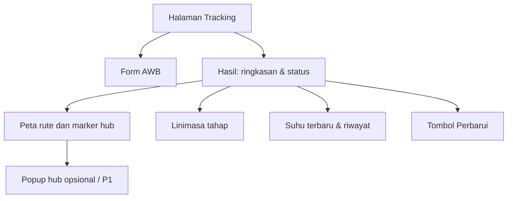
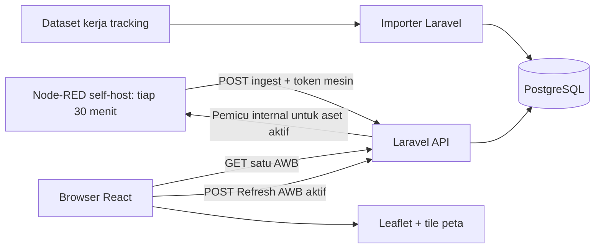

# IA — Information & Application Architecture

**Acuan:** [PRD](prd.md) · [FRD global](frd.md) · [DB](db.md)

“IA” di sini mencakup **arsitektur informasi antarmuka** dan **susunan teknologi aplikasi** agar implementasi satu halaman tidak memerlukan dokumen arsitektur terpisah.

## 1. Arsitektur informasi dan navigasi

Hanya **satu halaman utama**; keadaan kosong, memuat, AWB tidak ditemukan, gangguan jaringan, dan detail hasil adalah *state*, bukan halaman baru. Pada ponsel urutannya: pencarian → ringkasan → suhu terbaru → linimasa → peta → riwayat suhu; peta tidak boleh menghalangi informasi inti. Rancangan visual FR-01 yang telah dibuat ada di [design.md](ui/design.md).

## 2. Teknologi yang dipilih

| Lapisan | Pilihan | Alasan/batas pemakaian |
|---|---|---|
| FE | React + TypeScript + Vite | Komponen/state satu halaman, build ringan; React Router belum perlu. |
| UI | CSS biasa/CSS Modules, atau Tailwind **jika** proyek sudah memakainya | Hindari dua sistem gaya sekaligus; mobile-first. |
| Peta | Leaflet + React-Leaflet | Marker hub, polyline pink/abu-abu, fallback tekstual jika tile gagal. |
| API/BE | Laravel + PHP | Validasi, API publik, endpoint ingest internal, job impor, rate limiting, migrations, tests. |
| DB | PostgreSQL | Relasi paket–rute–aset–pembacaan dan indeks waktu; satu DB untuk lokal serta deployment. |
| Sumber suhu | Node-RED self-host | Inject interval ~30 menit **dan** pemicu HTTP internal dari backend saat Refresh → pembangkit pembacaan suhu → ingest Laravel. Node-RED bukan sumber status perjalanan. |
| Penyajian | Nginx + PHP-FPM, Docker Compose | FE build statis, API, DB, dan Node-RED sebagai servis terpisah dalam satu lingkungan uji. |
| Tes | PHPUnit/Laravel feature tests, Vitest/React Testing Library | Cakupan aturan API dan keadaan UI. E2E satu alur dapat memakai Playwright bila waktu cukup. |

Tidak perlu MQTT broker, queue, WebSocket, state manager global, atau layanan peta berbayar untuk P0. Paket versi spesifik dipilih dan dikunci saat implementasi, bukan ditebak di dokumen.

## 3. Aliran data dan batas sistem

Node-RED mengirim melalui API, **tidak** menulis langsung ke DB. Saat Refresh, Laravel menentukan aset aktif dan memanggil Node-RED secara internal; setelah ingest selesai, Laravel mengembalikan tracking terbaru. FE tidak menyimpan token mesin atau memilih suhu. API memvalidasi, membatasi frekuensi, menggabungkan permintaan serentak per aset, dan melakukan deduplikasi. Asosiasi suhu ke AWB dihitung lewat penugasan aset dan interval waktunya. Data status/rute dapat berubah hanya lewat sumber tracking yang kelak diimpor/diperbarui secara eksplisit, tidak karena pembacaan suhu. Paket delivered hanya membaca pembacaan akhir.

## 4. Deployment pengujian

Satu host pengujian cukup: reverse proxy melayani build React dan meneruskan `/api` ke Laravel; PostgreSQL dan Node-RED berada di jaringan internal Compose. Hanya web/API publik yang diekspos. Node-RED editor, endpoint pemicu internal, dan PostgreSQL tidak dibuka ke internet; endpoint ingest dilindungi token mesin, pemicu internal memakai kredensial antarlayanan, dan host publik memakai HTTPS. `POST /api/track/{awb}/refresh-temperature` yang dapat diakses pengunjung diberi rate limit serta timeout singkat. Simpan token, kredensial DB, serta APP_KEY di environment/secret, bukan repository. Jalankan migrasi dan seed secara eksplisit; backup DB bila lingkungan dipakai lebih dari sesi singkat.

Node-RED bersifat open source dan dapat dijalankan sendiri tanpa biaya lisensi, tetapi **server/hosting tidak otomatis gratis**. Jangan menggantungkan rancangan pada paket cloud gratis pihak ketiga. Tile OpenStreetMap publik hanya untuk pengujian ringan dengan atribusi dan kepatuhan pada kebijakan penggunaan; untuk pemakaian publik berkelanjutan, pilih penyedia tile yang sesuai. Sumber suhu ini belum tersambung ke sensor fisik; integrasi perangkat memerlukan pekerjaan tersendiri.

## 5. Rujukan teknologi

[Node-RED Inject](https://nodered.org/docs/user-guide/nodes) · [Node-RED HTTP endpoint](https://cookbook.nodered.org/http/create-an-http-endpoint) · [Lisensi Node-RED](https://github.com/node-red/node-red/blob/main/LICENSE) · [Leaflet marker/polyline](https://leafletjs.com/examples/quick-start/) · [Laravel documentation](https://laravel.com/docs/12.x) · [Docker Compose networking](https://docs.docker.com/compose/how-tos/networking/) · [Kebijakan tile OSM](https://operations.osmfoundation.org/policies/tiles/)
